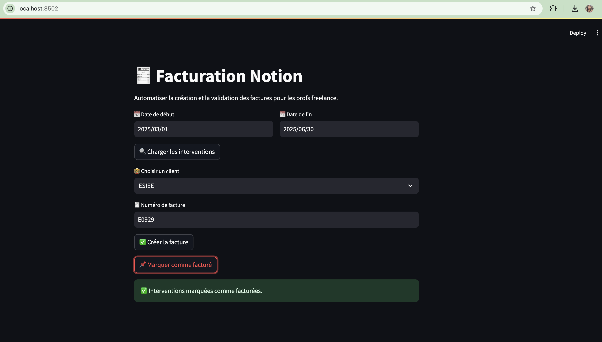

# 📘 Projet Python : Facturation automatique via Notion API

## 👩‍💻 Réalisé par : Imane Benamar

---

## 🖼️ Aperçu de l'interface Streamlit



## 🎯 Objectif du projet
Mettre en place un système automatisé pour :

- Récupérer les prestations réalisées par des profs freelance depuis Notion 📄
- Analyser les interventions à facturer (durée, tarif, total) 🧠
- Générer une **page de facture dans Notion** au bon format 🧾
- Marquer les interventions comme **facturées** ✅
- Utiliser une interface interactive avec **Streamlit** pour piloter tout le process 🖱️

---

## ✅ Fonctionnalités réalisées

| Fonction | État |
|---------|------|
| Chargement des clés avec `.env` | ✅ |
| Requête vers Notion API | ✅ |
| Extraction des interventions à facturer | ✅ |
| Analyse avec pandas (heures, total, par client/école) | ✅ |
| Création automatique de facture dans Notion | ✅ |
| Mise en page structurée (bloc Notion) | ✅ |
| Marquage des lignes “Facturé” dans Notion | ✅ |
| Interface web interactive avec Streamlit | ✅ |

---

## 🧩 Difficultés rencontrées

- Comprendre les **propriétés exactes** des bases Notion (champ "Facturé", "École", etc.)
- Filtrer proprement les données JSON issues de Notion API
- Gérer le format attendu par l’API pour la création de pages et blocs
- Conversion des DataFrames vers des formats compatibles Notion
- Intégration dans une interface Streamlit claire, fluide et fonctionnelle

---

## 📌 Prochaines étapes à réaliser

- [ ] Génération **automatique de numéro de facture** (ex: E0001 → E0002…)
- [ ] Export PDF ou CSV des factures
- [ ] Gestion multi-clients sur un seul clic (“Créer toutes les factures”)
- [ ] Déploiement en ligne via **Streamlit Cloud**
- [ ] Authentification ou sécurité (ex: mot de passe ou filtre par utilisateur)
- [ ] Gestion des erreurs/API (ex: token invalide, réponse vide, etc.)

---

## 🚀 Lancer le projet

```bash
pip install -r requirements.txt
streamlit run app.py
```

> N’oublie pas de créer un fichier `.env` avec tes clés Notion :

```
NOTION_TOKEN=...
DB_INTERVENTIONS_ID=...
DB_INVOICES_ID=...
```

---

## ❤️ Bravo à moi-même !

Ce projet m’a permis de :
- mieux comprendre les APIs REST
- manipuler des données structurées avec Python & pandas
- créer des interfaces interactives simples et efficaces
